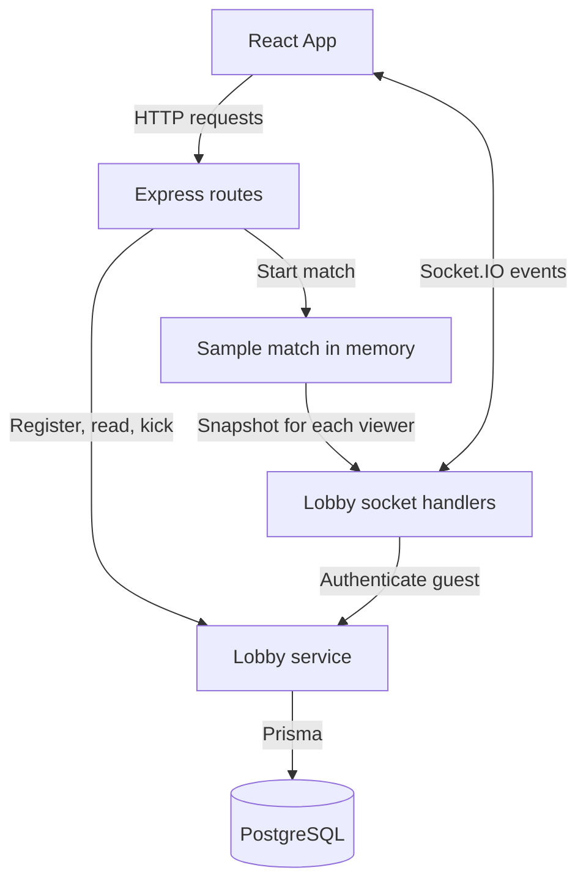

```mermaid
flowchart TD
    UI["React App"] -->|HTTP requests| API["Express routes"]
    UI <-->|Socket.IO events| RT["Lobby socket handlers"]
    API -->|Register, read, kick| Lobby["Lobby service"]
    RT -->|Authenticate guest| Lobby
    Lobby -->|Prisma| DB[("PostgreSQL")]
    API -->|Start match| Match["Sample match in memory"]
    Match -->|Snapshot for each viewer| RT
```
